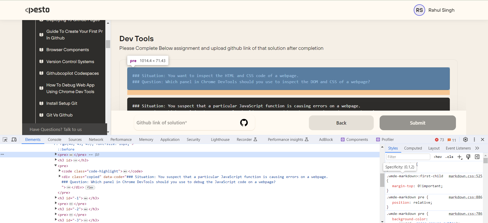
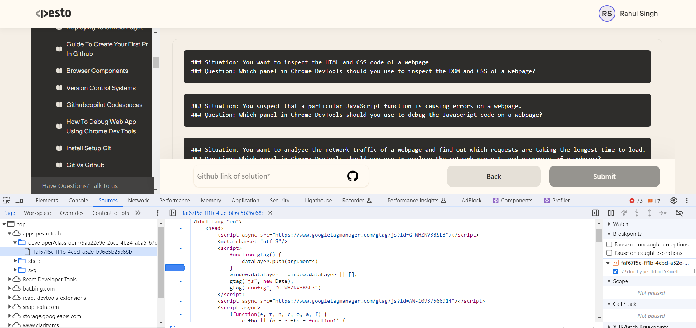
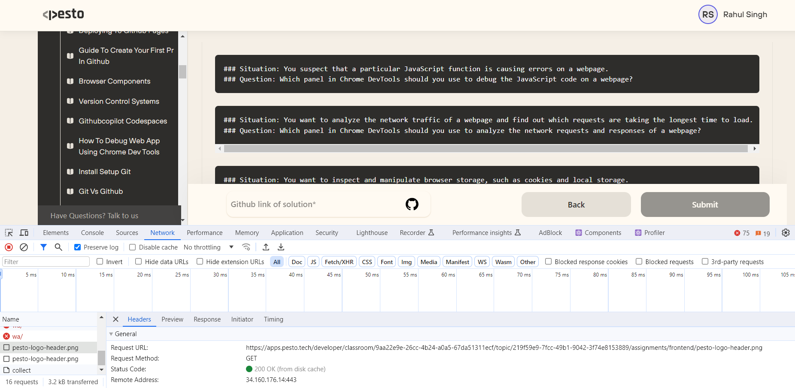
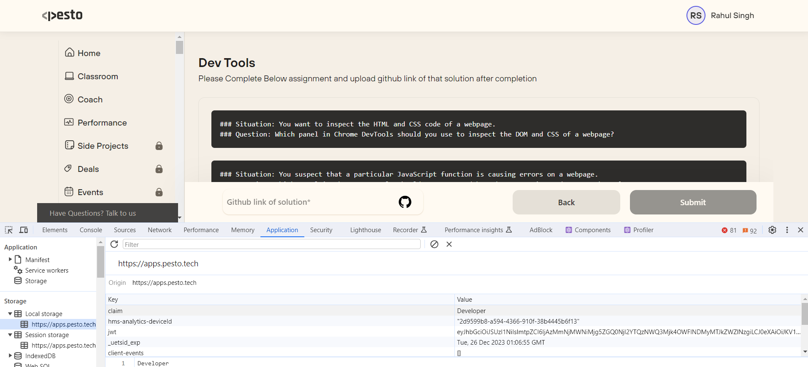
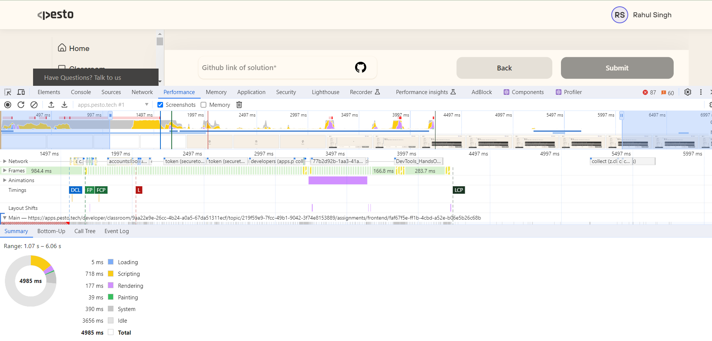
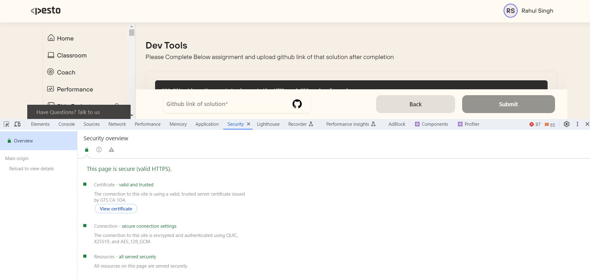
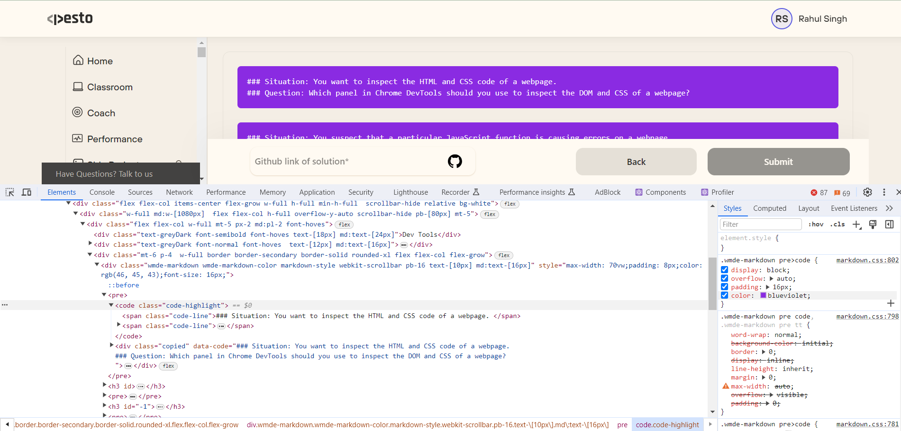
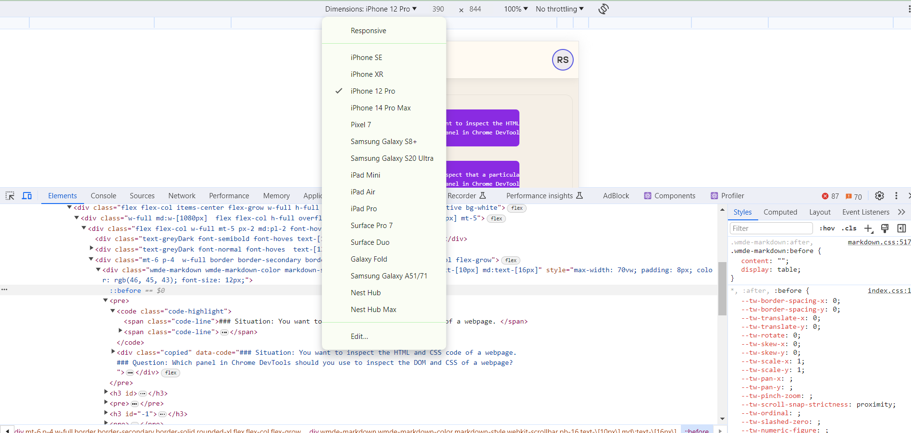

### Situation: You want to inspect the HTML and CSS code of a webpage.
### Question: Which panel in Chrome DevTools should you use to inspect the DOM and CSS of a webpage?

```
To inspect the HTML (DOM) and CSS code of a webpage in Chrome DevTools, you should use the "Elements" panel. This panel allows you to explore the document structure, view and modify HTML elements, and inspect the applied CSS styles for each element. Simply right-click on an element on the webpage and select "Inspect" or navigate to the "Elements" tab in the Chrome DevTools to access this panel.
  
```


### Situation: You suspect that a particular JavaScript function is causing errors on a webpage.
### Question: Which panel in Chrome DevTools should you use to debug the JavaScript code on a webpage?
``` 
To debug JavaScript code on a webpage in Chrome DevTools, you should use the "Sources" panel. This panel allows you to view and debug the JavaScript source code of a webpage. You can set breakpoints, step through code, inspect variables, and monitor the call stack to identify and resolve issues in your JavaScript functions. Access the "Sources" tab in Chrome DevTools to navigate through the scripts and debug your JavaScript code effectively.
 
```



### Situation: You want to analyze the network traffic of a webpage and find out which requests are taking the longest time to load.
### Question: Which panel in Chrome DevTools should you use to analyze the network requests and responses of a webpage?
``` 
To analyze the network traffic of a webpage and identify requests taking the longest time to load, you should use the "Network" panel in Chrome DevTools. This panel provides a comprehensive view of all network requests made by the webpage, including their timing, status, size, and other relevant details. You can use various filters and sorting options to focus on specific requests and diagnose performance issues related to network loading. Access the "Network" tab in Chrome DevTools to monitor and analyze the network activity of a webpage.

```



### Situation: You want to inspect and manipulate browser storage, such as cookies and local storage.
### Question: Which panel in Chrome DevTools should you use to inspect and manipulate browser storage on a webpage?
```
To inspect and manipulate browser storage, including cookies and local storage, on a webpage, you should use the "Application" panel in Chrome DevTools. This panel provides a comprehensive view of various aspects related to web applications, including:

- Storage: Allows you to view and manage cookies, local storage, session storage, and other types of client-side storage.
- Cache: Provides information about the Cache Storage, where resources are cached for offline use.
- Manifest: Displays details about the web app manifest, which defines how the app appears when installed on a user's device.
 
```



### Situation: You want to optimize the performance of a webpage and identify potential bottlenecks.
### Question: Which panel in Chrome DevTools should you use to analyze the performance of a webpage and identify potential bottlenecks?
``` 
To analyze the performance of a webpage, identify potential bottlenecks, and optimize its speed, you should use the "Performance" panel in Chrome DevTools. This panel allows you to record and analyze the runtime performance of your web application, including:

- Loading times: Identify how long it takes for resources to load.
- CPU usage: Examine the CPU utilization during the page's lifecycle.
- Network activity: View network requests and responses.
- User interactions: Understand how user interactions impact the page's responsiveness.

By recording a performance profile using the "Performance" tab, you can pinpoint areas of improvement, detect bottlenecks, and optimize the webpage for a better user experience.
 
```



### Situation: You want to test the security of a webpage and check if it has any vulnerabilities.
### Question: Which panel in Chrome DevTools should you use to analyze the security of a webpage and identify potential vulnerabilities?
``` 
To analyze the security of a webpage and identify potential vulnerabilities, you should use the "Security" panel in Chrome DevTools. This panel provides insights into the security aspects of a webpage, including:

- Secure Connection: Verifies if the page is served over HTTPS and provides details about the SSL certificate.
- Mixed Content: Flags any insecure (HTTP) resources loaded on a secure (HTTPS) page.
- Certificate Transparency: Checks if the SSL certificate has been logged in a public certificate transparency log.
- Security Issues: Highlights any security-related issues or vulnerabilities detected on the webpage.

By navigating to the "Security" tab in Chrome DevTools, you can assess the security status of the webpage and address any potential security risks or concerns. This is particularly important for ensuring a secure browsing experience for users and protecting against various web-related threats.
 
```



### Situation: You want to view and modify the CSS styles of a webpage in real-time.
### Question: Which panel in Chrome DevTools should you use to view and modify the CSS styles of a webpage in real-time?
``` 
To view and modify the CSS styles of a webpage in real-time, you should use the "Elements" panel in Chrome DevTools. This panel allows you to inspect and edit HTML elements, including their associated CSS styles.

Here's a quick guide on using the "Elements" panel for real-time CSS inspection and modification:

1. Right-click on the element you want to inspect on the webpage.
2. Select "Inspect" from the context menu to open the "Elements" panel.
3. In the "Styles" or "Computed" tab within the "Elements" panel, you can view and modify the CSS styles applied to the selected element.
 
```



### Situation: You want to test how a webpage looks and behaves on different screen sizes.
### Question: Which panel in Chrome DevTools should you use to test the responsiveness of a webpage on different screen sizes?
```
To test how a webpage looks and behaves on different screen sizes, you should use the "Device Mode" in Chrome DevTools. The "Device Mode" allows you to simulate various devices and screen sizes to ensure that your webpage is responsive and displays correctly across different devices.

Here's how you can use Device Mode:

1. Open Chrome DevTools (F12 or right-click and select "Inspect").
2. Toggle Device Mode by clicking the "Toggle Device Toolbar" icon (usually looks like a mobile or tablet device) in the top-left corner of DevTools. 

```
 